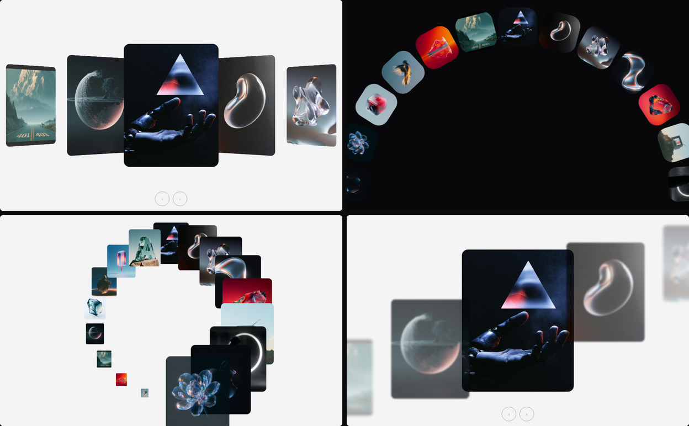
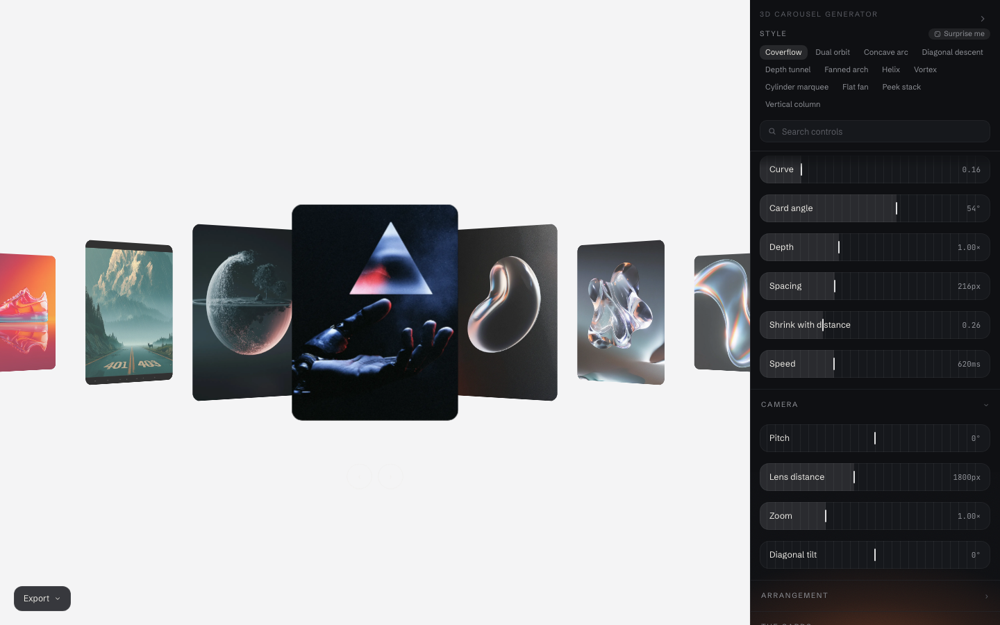

# 3D Carousel Generator

Build a 3D carousel by moving sliders, then copy it out and use it on your own
site. No signup, no dependencies, no build step in what you take away.



Twelve named styles ship — coverflow, dual orbit, concave arc, diagonal descent,
depth tunnel, fanned arch, helix, vortex, cylinder marquee, flat fan, peek stack
and vertical column — but they are only memorable positions on the dials. Every
setting in between is a real carousel too, including thousands nobody has named.



The carousel has the whole window. The tools sit in a drawer on the right that
collapses to a notch and gives the room back, and each style is framed to its own
shape rather than to one fixed box. Export copies the code or an AI prompt
straight to the clipboard — what it hands over is the same engine the preview is
running, not a description of it.

## Run it

```bash
pnpm install
pnpm dev
```

The preview images ship prepared in `public/img/`, so that's all you need to
run it.

Other things you can run:

```bash
pnpm test           # the unit suite
pnpm test:visual    # committed screenshots of every style
pnpm build:engine   # rebuild the embeddable bundle after changing src/engine/
pnpm shoot:editor   # one contact sheet of all twelve in the editor, for judging framing
pnpm prep:images    # only if you add your own stills to images/ and want new webp
```

## How it works

**Every carousel here is the same arrangement at different settings.** Coverflow
and a rotating ring are not two effects — they are one `curve` slider at either
end of its travel, because every card sits on a circular arc of radius
`spacing / stepAngle`. Push the curve to 1 and the ring closes exactly; take it
to 0 and the radius goes to infinity, so the arc becomes a straight track with
the same gap between cards. The named styles are parameter objects, not code, and
there is no per-style branch anywhere in the engine.

**There is exactly one implementation.** `src/engine/` is dependency-free
TypeScript — no React, no Tailwind, nothing from the app — and three things
consume it: the editor's live preview, the snippet you copy out, and the tests.
The preview *literally runs the exported engine*, so what you see is what you
copy by construction rather than by discipline. A test mounts both and compares
every card; if anyone ever reintroduces a second implementation, that is what
fails.

**What you copy is one block.** Markup, only the CSS those settings actually use,
the engine, and the call that starts it. It has no dependencies and needs no
build step, the image paths are relative placeholders, and it scales itself to
fit whatever width you drop it into. There is a second tab that describes the
same carousel in precise English instead, to hand to Claude, Cursor or ChatGPT
so it can be rebuilt in a framework we do not maintain.

## Where things live

| | |
|---|---|
| `src/engine/` | the whole thing — geometry, motion, the DOM controller. No app imports. |
| `src/engine/presets.ts` | the twelve, as numbers |
| `src/engine/export/` | the two outputs, and the test that keeps them honest |
| `src/components/editor/` | the editor's chrome, generated from the parameter metadata |
| `scripts/` | image prep, engine bundling, and the probes used to tune the styles |

## Licence

MIT — see [LICENSE](LICENSE). The imagery in `public/img/` is prototype material
and is not part of the licence grant.
